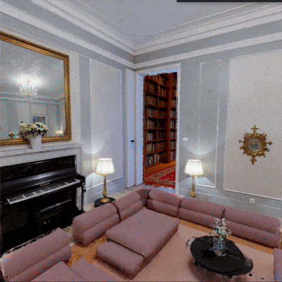

# Gaussian Splat Transition Tech Demo



A first-person technical demonstration showcasing a shader-based
transitions between multiple Gaussian Splat environments generated by Marble.
Built with **React Three Fiber**, and **Spark**.

## Technologies Used

- [React](https://react.dev/) & [Vite](https://vitejs.dev/)
- [Three.js](https://threejs.org/) &
  [React Three Fiber](https://docs.pmnd.rs/react-three-fiber/) &
  [Drei](https://drei.docs.pmnd.rs/getting-started/introduction)
- [@sparkjsdev/spark](https://sparkjs.dev/) - Advanced Gaussian Splat rendering.
- [Zustand](https://github.com/pmndrs/zustand) - State management.
- [GSAP](https://gsap.com/) - Animation handling for transition curves.
- [BVHEcctrl](https://github.com/pmndrs/BVHEcctrl) - Physics-based character controller.
- [Tailwind CSS](https://tailwindcss.com/) - UI styling.

## Getting Started

1. Clone the repository:

   ```bash

   git clone https://github.com/willemhelmet/one-room-dungeon.git

   ```

2. Install dependencies:

   ```bash

   npm install

   ```

3. Navigate into the project directory:

   ```bash

   cd one-room-dungeon

   ```

4. Run the local development server:

   ```bash

   npm run dev

   ```

5. Open `http://localhost:5173` in your browser.

## Deployment

This project is configured for GitHub Pages.

```bash
npm run deploy
```
